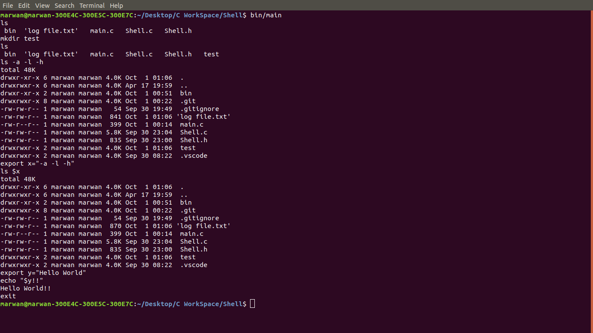

# Shell



This is a Unix shell program. A shell is simply a program that conveniently allows you to run other programs.

Shell supports the following commands:

1. The internal shell command "exit" which terminates the shell.

2. A command with no arguments.
   * **Example**: ls, cp, rm …etc
   
3. A command with arguments
    * **Example**: ls –l
    
4. A command, with or without arguments, executed in the background using &.
    * **Example**: firefox &
    
    * **Details**: In this case, The shell executes the command and return immediately, not blocking until the command finishes.
    
5. Shell builtin commands
    * **Commands**: cd & echo
    
    * **Details**: for the case of:
        * **cd**

        * **echo**: Prints the input after evaluating all expressions (**Input to echo must be within double quotations**).
            * echo "wow" => wow
            * export x=5
            * echo "Hello $x" => Hello 5
            
6. Expression evaluation
    * **Commands**: export
    
    * **Details**: Set values to variables and print variables values.
    
    * **Export Details**: Accept input of two forms, either a string without spaces, or a full string inside double quotations.
    
    * **Example**:
        * export x=-l
        * ls $x => Will perform ls -l
        * export y="Hello world"
        * echo "$y" => Hello world

## Pseudocode

```Pseudocode
function main()
    shell()

function shell()
    do
        parse_input(read_input())
        evaluate_expression()

        if shell_builtin:
            execute_shell_bultin
        else if executable:
            execute_command()

    while command_is_not_exit


function execute_command()
    fork()
    if child:
        execvp(command parsed)
    else if parent and foreground:
        waitpid(child)
```
